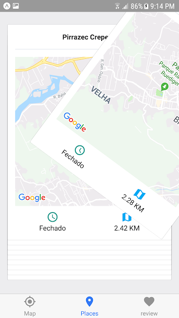

# react-native-places

this project helps you to find coffee shops around you, basically you can define a location then we going to search on google places API the nearest coffee shops. 

the app is divided into:

- walkthrough: when you first login the app you going to see a 3 screens walkthrough explaining the main idea.
- Login with facebook - a basic login screen that allows you only login with Facebook.
- Find a place: after successfully access you going to be redirected to a map where you can define a location and search coffee shops.
- Select the best places: after searching for places, you will be redirected to a screen to define if you like or not what we show. Swipe left to dismiss and right to add this place in your favorites.
- Finally, you can see your favorite places and details and also see on the maps. 

The entire app is not UX oriented. So all these steps were made to learn more about building react native apps using expo. 

## Some images: 

- Find a place:

- Analyze it:

 

- Your favorites:

